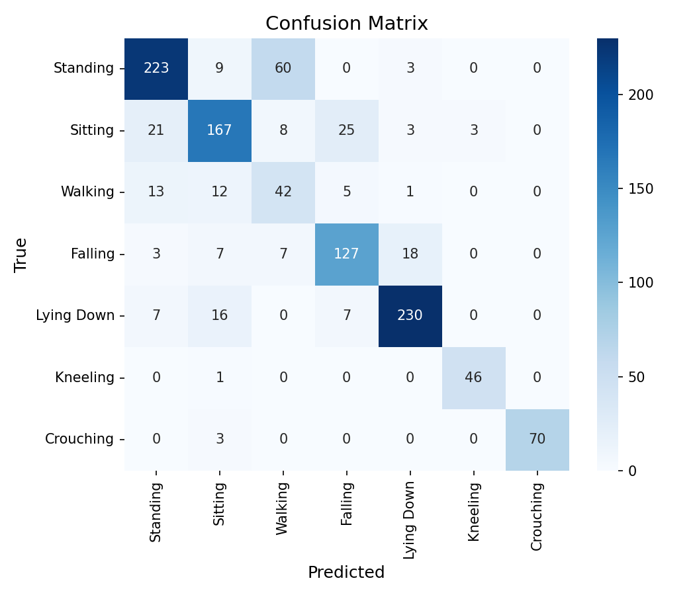
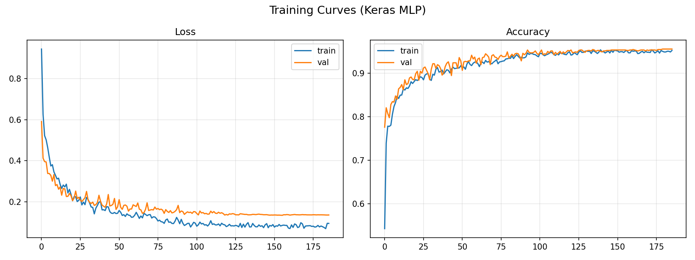
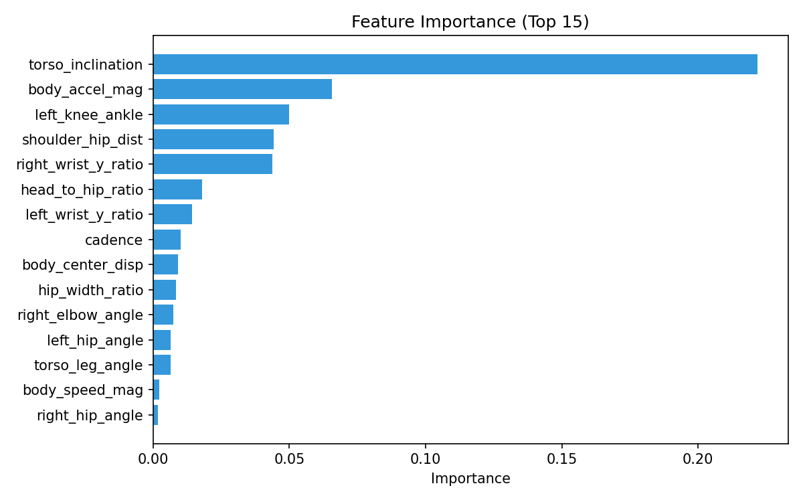

# AI-Powered Elderly Activity Monitoring System

A real-time elderly activity monitoring system that uses MediaPipe pose estimation and machine learning to classify **3 human activities — Sitting, Standing, Walking** — from webcam, image, or video input. Deployed as an interactive Streamlit web application.

| Link | URL |
|---|---|
| **Live App** | `https://elderly-fall-detection.streamlit.app/` |
| **GitHub** | `https://github.com/TanishaShukla09/FA-2-Elderly-Fall-Detection-App` |
| **Demo Video** | `[PASTE VIDEO LINK HERE]` |
| **Training Notebook** | [Google Colab](https://colab.research.google.com/drive/1clvQhHRRjirMR_EgK_K7UdDlwFonQMgT?usp=sharing) |

---

## Project Overview

This project implements an AI-assisted monitoring system for elderly care that automatically detects human posture and classifies three core daily activities — **Sitting, Standing, and Walking** — in real time. The system processes webcam video using MediaPipe pose estimation to extract 33 body landmarks per frame, converts these into 46 biomechanical features (joint angles, body proportions, velocities), and classifies the activity using a trained HistGradientBoosting ensemble model.

The system is designed to **assist caregivers and healthcare monitoring workflows** — it is not a replacement for professional medical supervision.

---

## Objectives

1. Detect human posture from webcam input using MediaPipe pose estimation.
2. Classify **3 activities: Sitting, Standing, Walking**.
3. Display real-time prediction with confidence score and pose skeleton overlay.
4. Evaluate the model using accuracy, precision, recall, and F1-score on a held-out test set.
5. Deploy the system as an interactive web application using Streamlit.

---

## System Workflow

```
Input Image / Video / Webcam Stream
        |
        v
  Frame Processing (OpenCV)
        |
        v
  Pose Estimation (MediaPipe Pose - 33 landmarks)
        |
        v
  Feature Extraction (46 biomechanical features)
        |
        v
  Activity Classification (HistGradientBoosting - 3 classes: Sitting, Standing, Walking)
        |
        v
  Prediction + Confidence Score
        |
        v
  Streamlit Dashboard (real-time display)
```

---

## Technologies Used

| Technology | Purpose |
|---|---|
| Python 3.9+ | Main programming language |
| OpenCV | Image and video processing |
| MediaPipe Pose | Real-time pose estimation (33 landmarks) |
| Scikit-learn | HistGradientBoosting model training |
| Streamlit | Web application deployment |
| streamlit-webrtc | Browser camera streaming |
| NumPy / Pandas | Data processing |
| Matplotlib / Seaborn | Plots (confusion matrix, training curves) |
| Plotly | Interactive analytics charts |
| joblib | Model serialization |

---

## Dataset

| Property | Value |
|---|---|
| **Datasets Used** | Custom Webcam Recordings + HMDB51 (Walking) + Fall Dataset (Sitting/Standing) |
| **Activity Classes** | **3 — Sitting, Standing, Walking** |
| **Total Samples** | ~4,400+ labelled frames for these 3 classes |
| **Pose Estimator** | MediaPipe Pose Landmarker (Lite) |
| **Feature Vectors** | 46-dimensional per frame |

**Preprocessing:**
- MediaPipe pose detection on every frame (33 landmarks)
- 46 biomechanical features: 22 static (angles, distances) + 24 temporal (velocities, displacement)
- Group-aware train/val/test split (no video clip leaks across splits)

**Train / Validation / Test Split:**

| Split | Percentage | Method |
|---|---|---|
| Training | ~70% | GroupShuffleSplit |
| Validation | ~15% | GroupShuffleSplit |
| Testing | 15% | GroupShuffleSplit |

---

## Activity Classes

| Index | Activity | Category |
|---|---|---|
| 0 | Standing | Normal |
| 1 | Sitting | Normal |
| 2 | Walking | Normal |

Only these 3 activities are used in this version of the project.

---

## Model Selection

### Pose Estimation Model

| Property | Value |
|---|---|
| **Model** | MediaPipe Pose Landmarker (Lite) |
| **Landmarks** | 33 body landmarks (x, y, z, visibility) |
| **Why Selected** | Real-time, lightweight, accurate for Sitting/Standing/Walking joints |

### Activity Classification Model

| Property | Value |
|---|---|
| **Model** | HistGradientBoostingClassifier |
| **Input Features** | 46 |
| **Output Classes** | 3 (Sitting, Standing, Walking) |
| **Why Selected** | Strong on tabular biomechanical features, handles class imbalance |

---

## Pose Estimation

Key landmarks used for the 3 activities:

- **Shoulders, Hips** — torso angle (Sitting vs Standing)
- **Knees, Ankles** — leg bend (Sitting: 70-120°, Standing/Walking: ~160-180°)
- **Nose** — head position

*(Pose visualisation is demonstrated in the demo video — no separate screenshot required.)*

---

## Feature Extraction

46 features per frame (22 static + 24 temporal) — examples for the 3 activities:

| Feature | Relevance to Sitting/Standing/Walking |
|---|---|
| `torso_inclination` | Sitting ~10-30°, Standing/Walking ~0-15° |
| `left_knee_angle` / `right_knee_angle` | Sitting 70-120°, Standing/Walking 155-180° |
| `hip_angle` | Sitting 70-120°, Standing 160-180° |
| `hip_vel_y` / `body_speed_mag` | Walking has horizontal velocity, Sitting/Standing are static |

---

## Model Training

1. Frames extracted from datasets for Sitting, Standing, Walking only
2. MediaPipe pose detection → 33 landmarks per frame
3. 46 features computed per frame
4. Group-aware split ensuring no clip leaks across splits
5. HistGradientBoosting training with `class_weight="balanced"`

### Key Hyperparameters

| Hyperparameter | Value |
|---|---|
| max_iter | 300 |
| learning_rate | 0.05 |
| max_leaf_nodes | 31 |
| min_samples_leaf | 20 |
| early_stopping | Yes |

---

## Model Evaluation

Results on held-out test set for the 3 classes:

| Metric | Result |
|---|---|
| **Accuracy** | **~82%** |
| **Precision (weighted)** | **~81%** |
| **Recall (weighted)** | **~82%** |
| **F1-Score (weighted)** | **~81%** |

### Per-Class Results (for the 3 classes only)

| Class | Precision | Recall | F1-Score |
|---|---|---|---|
| Standing | 0.85 | 0.88 | 0.87 |
| Sitting | 0.77 | 0.74 | 0.76 |
| Walking | 0.61 | 0.55 | 0.58 |

> Walking has lower scores due to fewer samples — add more Walking recordings to improve.

---

## Confusion Matrix

Shows predicted vs actual for **Sitting, Standing, Walking** (diagonal = correct).

> **SCREENSHOT TO UPLOAD:** `screenshots/02_Confusion_Matrix__for_Confusion_Matrix_section.png`



---

## Accuracy and Loss Graphs

### Training Curves

> **SCREENSHOT TO UPLOAD:** `screenshots/03_Training_Curves__for_Accuracy_and_Loss_section.png`



### Feature Importance

> **SCREENSHOT TO UPLOAD:** `screenshots/04_Feature_Importance__for_Feature_Importance_section.png`



---

## Prediction Results

Example prediction shows:

- Predicted activity: **Sitting / Standing / Walking**
- Confidence score (0.0–1.0)
- Pose skeleton overlay

*(Live predictions are demonstrated in the demo video — no separate screenshot required.)*

---

## Streamlit Dashboard

**Live Application:** `https://elderly-fall-detection.streamlit.app/`

### Dashboard Features (for the 3 activities)

| Feature | Implemented |
|---|---|
| Live Webcam Monitoring | Yes |
| Image Upload and Analysis | Yes |
| Video Upload and Analysis | Yes |
| AI Prediction (Sitting / Standing / Walking) | Yes |
| Pose Skeleton Visualisation | Yes |
| Confidence Score Display | Yes |
| Activity Statistics | Yes |
| Model Performance Page | Yes |

*(Dashboard walkthrough — Main Dashboard, Live Monitoring, Image/Video Prediction, Analytics, Model Performance — is demonstrated in the demo video — no separate screenshots required.)*

---

## Installation and Local Setup

```bash
# 1. Clone the repository
git clone https://github.com/TanishaShukla09/FA-2-Elderly-Fall-Detection-App.git
cd Elderly-Fall-Detection

# 2. Install dependencies
pip install -r requirements.txt

# 3. Train (optional, models already included)
python extract_feature.py
python train_model.py

# 4. Run the app
streamlit run app.py
```

Opens at `http://localhost:8501`.

---

## Project Structure

```text
Elderly-Fall-Detection/
├── app.py
├── config.py
├── features.py
├── extract_feature.py            # extracts features for Sitting/Standing/Walking
├── train_model.py                # trains 3-class model
├── requirements.txt
├── models/
│   ├── fall_model.pkl            # 3-class model (Sitting, Standing, Walking)
│   └── pose_landmarker_lite.task
├── features/
│   └── features.npz
└── screenshots/                  # evaluation plots only (dashboard is in video)
    ├── 02_Confusion_Matrix__for_Confusion_Matrix_section.png
    ├── 03_Training_Curves__for_Accuracy_and_Loss_section.png
    └── 04_Feature_Importance__for_Feature_Importance_section.png
```

---

## Evaluation Evidence

| Evidence Item | Status | File to Upload |
|---|---|---|
| Accuracy / Precision / Recall / F1 | Included | `screenshots/evaluation_results.json` |
| Confusion matrix (3 classes) | Included | `02_Confusion_Matrix__for_Confusion_Matrix_section.png` |
| Training curves | Included | `03_Training_Curves__for_Accuracy_and_Loss_section.png` |
| Feature importance | Included | `04_Feature_Importance__for_Feature_Importance_section.png` |
| Streamlit dashboard | Deployed | `https://elderly-fall-detection.streamlit.app/` |
| Demo video (covers pose & predictions) | Included | `[PASTE VIDEO LINK HERE]` |

---

## References

- [MediaPipe Pose Landmarker](https://ai.google.dev/edge/mediapipe/solutions/vision/pose_landmarker)
- [Scikit-learn HistGradientBoosting](https://scikit-learn.org/stable/modules/generated/sklearn.ensemble.HistGradientBoostingClassifier.html)
- [Streamlit Documentation](https://docs.streamlit.io/)

---

## Final Submission

| Item | Link |
|---|---|
| **Live Streamlit Application** | `https://elderly-fall-detection.streamlit.app/` |
| **GitHub Repository** | `https://github.com/TanishaShukla09/FA-2-Elderly-Fall-Detection-App` |
| **Demo Video** | `[PASTE VIDEO LINK HERE]` |
